# Shopping Delight

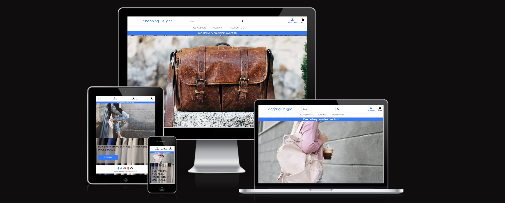

Shopping delight is a retail e-commerce site to allow users to easily browse different clothing products with categorisation or even through personalized searches to make the process smoother. Users are able to sign up to have individual profiles and save their user information.

The site is fully responsive and designed in a simplistic and easy to navigate manner. It has been coded using HTML, CSS, JavaScript, Python and Django and the Bootstrap frameworks.

# User Experience

Link to Kanban board can be found here [https://github.com/users/Chrisloufa/projects/2/views/1](https://github.com/users/Chrisloufa/projects/2/views/1)

## Strategy

This website is for a Business to Consumer (B2C) business that sells clothing products.

Customers who visit the site will be able to:

- Easy to Navigate and filter/search by category.
- Has the ability to view and purchase items.
- Has an email subscription service.
- Has links to Social Media sites Facebook.
- User Account functionality, to keep track of order history and store delivery information.
- Able to add products to a wishlist for future purchase.
- Able to make reviews of products on the site.

And the owner of the site will be able to add:

- Appealingly displays their products.
- Allows them to add, edit and remove products.
- Allows customers to get in contact if required.
- Able to edit customer orders.

# User Stories

- As a **Shopper** I can **view a list of product** so that **I can choose what to buy.**
- As a **Shopper** I can **sort the list of available products** so that **I can easily identify the best rated products and best prices etc.**
- User can view lists of items for sale and search by name, filter by price.
- As a **Site User** I can **easily register for an account** so that **I have a personal account and. can view my profile.**
- As a **Shopper** I can **easily select the size and quantity of a product when purchasing it** so that **I can ensure that I do not accidentally select the wrong product, quantity or size.**
- User can signup/login/logout.
- User can add items to shopping cart and the app remembers it next time you login. User can view all the items in their shopping cart. User can delete items in the shopping cart. Shopping cart uses an integer column to store "state".
- User can fill in form and submit billing info. After submitting billing info, items in the shopping cart will move to a different "state".
- User can create reviews for products and rate the out of 5 stars.
- User can sign up to receive news letter.
- As a shopper I want to be able to adjust the number of products in my basket so that I can make changes to my purchases before checkout.
- As a shopper I want to be able to feel that my personal and payment details are safe and secure so that I can confidently carry out my purchase.
- As a shopper I want to be able to view an order confirmation so that I can verify my order is correct.
- As a shopper I want to be able to order without creating an account so that I can make one-off orders.
- As a shopper I want to be able to easily see what I’ve searched for and the number of results so that I can quickly see whether the product is available.
- As a shopper I want to be able to recover my password so that I can recover my account access.
- As a shopper I want to be able to sign up for emails so that I can be notified of new releases, deals, and upcoming sales.
- As a shopper, I want to be able to be able to edit and remove my reviews of products purchased so I can share or remove my reviews if my opinions change.

## Superuser / Admin
-	As a Site Owner I want to be able to add a product so that I can add more items to my store.
-	As a Site Owner I want to be able to Edit/Update a product so that I can change the price, description, and other product criteria.
-	As a Site Owner I want to be able to delete a product so that I can remove items that are no longer available.
-	As a Site Owner I want to be able to send emails to customers with a subscription, notifying customers of any deals, sales, and new arrivals.
-	As a Site Owner, I want to be able to remove reviews from the site without deleting them so that can still be available if required.
- As a site owner I would like to set up discount codes to share with loyal customers. 

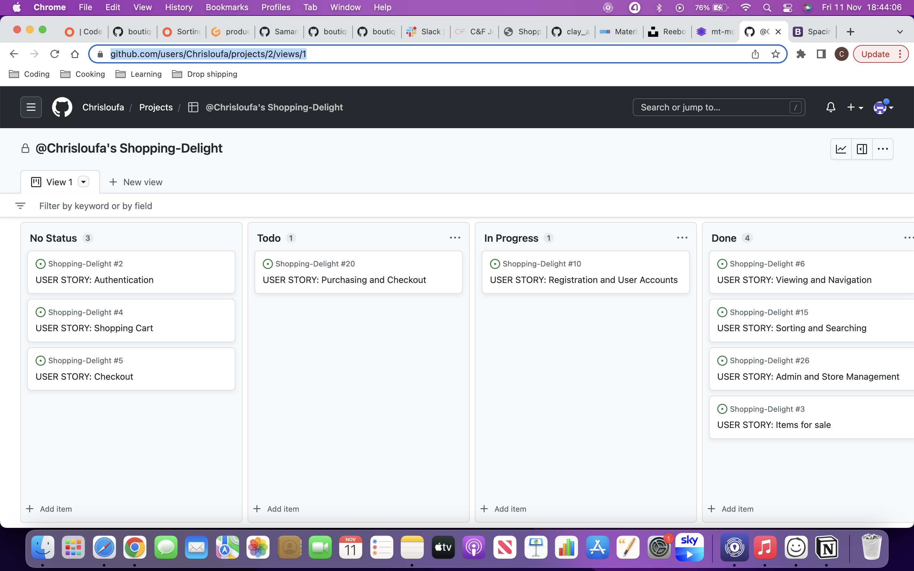

# WireFrames

## Desktop Wireframes

Desktop Wireframes - Click Here:

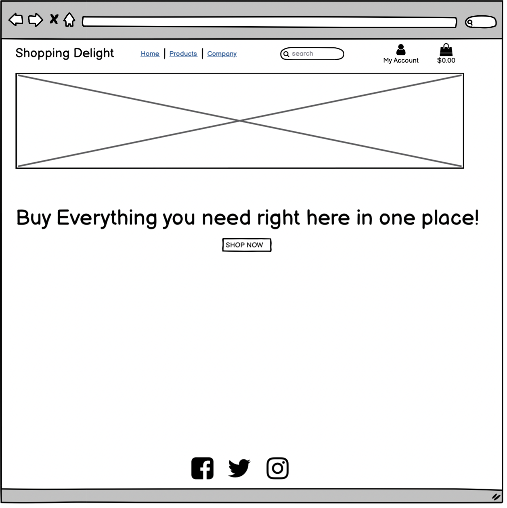
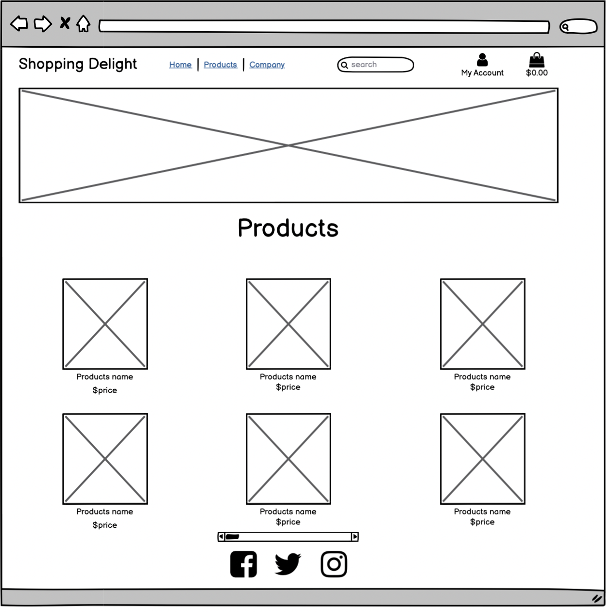

## Tablet Wireframes

Tablet Wireframes - Click Here:

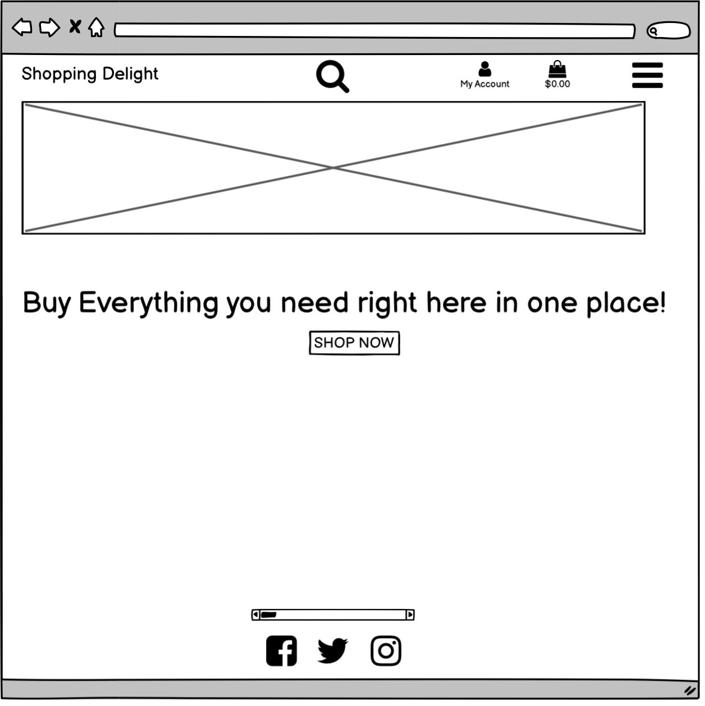
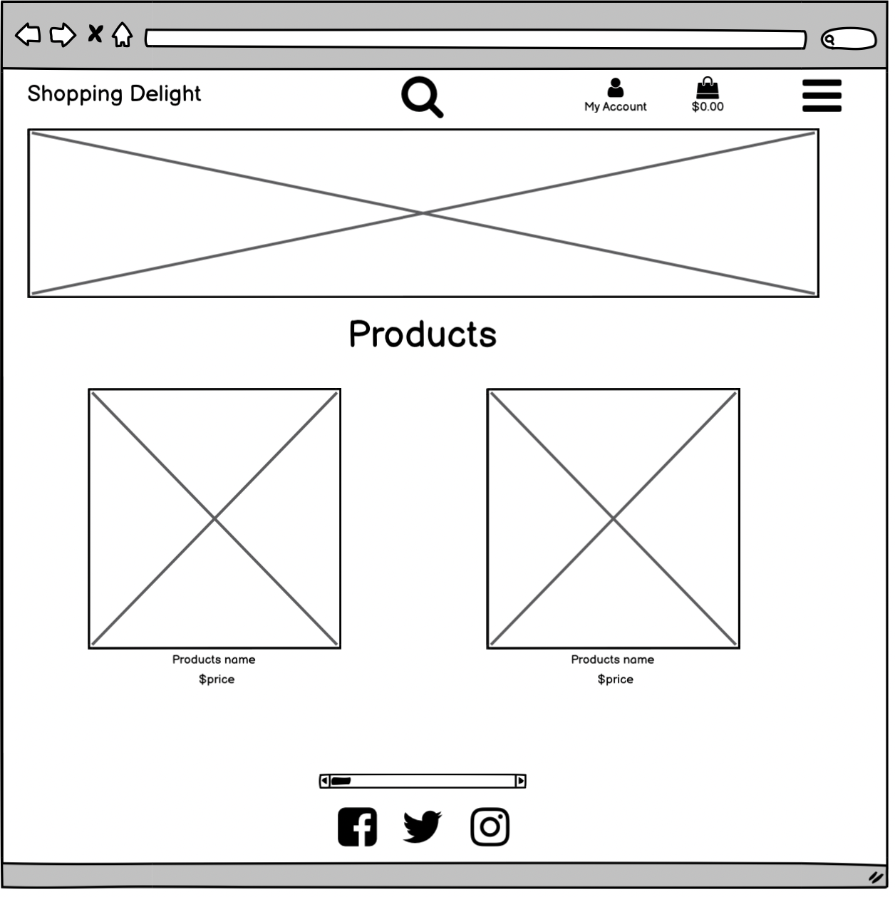

## Mobile Wireframes

Mobile Wireframes - Click Here:

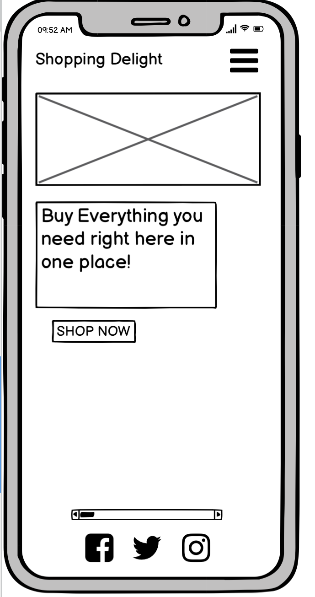
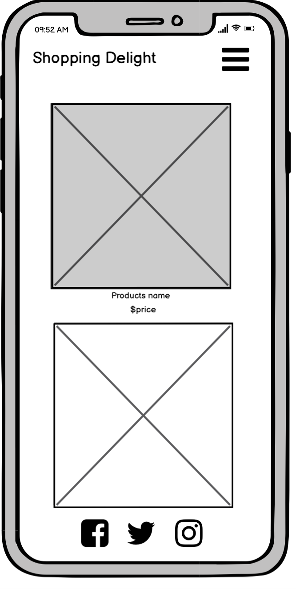

# Design

The colour scheme was selected to be cool and basic as to not take the focus away from the content that is important on the screen.

## Colour Scheme

The colour scheme was kept clean to keep the focus on the products on the site. Also looks modern and contemporary.
The body uses black(rgb(0,0,0)) to keep writing clear and easy to read on a white (rgb(255,255,255)) background. All main function buttons and the website logo uses Blue (#007bff) to stand out from the rest of the webite, this makes it easy for the user to be aware of what buttons they can interact with.

Here you can see a color palette:

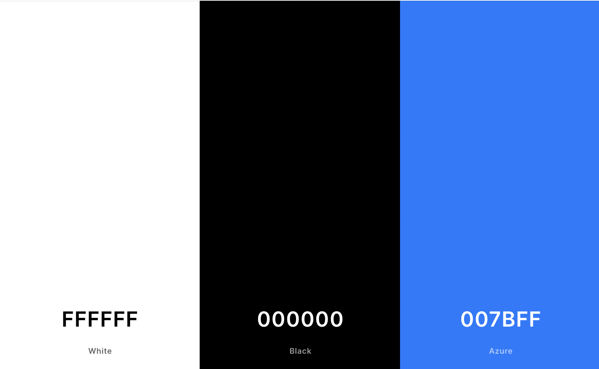

## Font Choice

I chose the Google Font Raleway to act as the primary font for the website, including for the logo. It provides a nice clean and clear style without any readability problems - a vital design feature for any website. This is available for free via [https://fonts.google.com/]. Sans Serif is used as a secondary option in case of failure to load the font into the website correctly. 

There are some stylistic changes to the font (the use of <strong>), but mostly with just colour changes for impact, attention or contrast and readability purposes.

# Database

## Database Schema

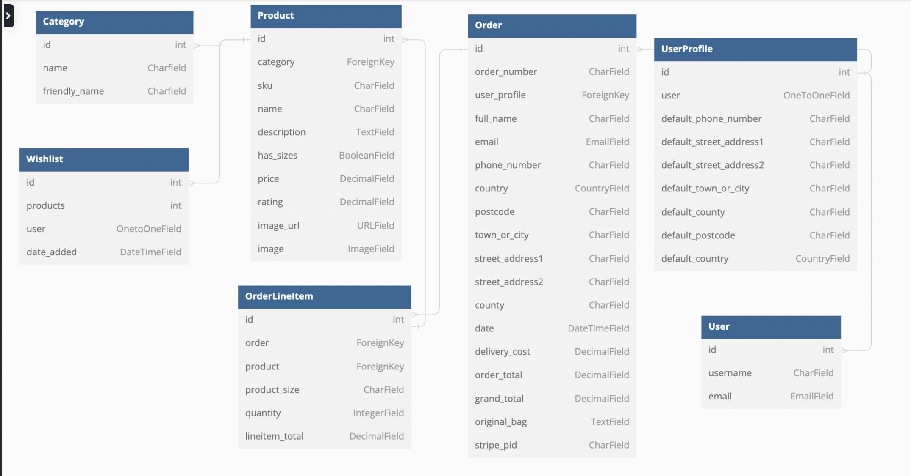

It shows each model present in the project and the relationship between them.
This schema is vital in developing the website's functionality, its features and what users are capable of doing.

# Features

## Custom User Model
To capture additional user information, such as address, I opted to override the default Django user model and create a custom one. This enabled me to store all the necessary user data in one object. It will also make any future user model changes easier to make.

Given the additional data input requirements, I had to specify custom forms in order to capture all the required information. This included overriding Django default forms, for example, the admin forms for adding/modifying user details.

## Accounts
This is where all customer information is retained via the custom user model. I also made the decision to use Django-allauth which added the ability to override the username field, using the email address as the login. It also brought with it the ability to verify email addresses and reset passwords.

Within this app I have overriden a number of the default forms provided by allauth to integrate with the customer user model. To produce responsive forms I have used the django-crispy-forms helper function which allows me to create custom form layouts with individual element styling. I have also modified the rendering of the django admin site for the user object, to provide a better structure.

Outlined below are the views that are produced by this app:

a) **Signup:** a custom form used to create a new user account with the custom user model. The username field is removed, with the email address used in it's placed. Given this is an ecommerce application, it made more sense to proceed with email only, as a username would not serve any other function than to login.

b) **Login:** Enables users to login using their email address and password. If any products exist in a user's basket before they login, these will be merged into any existing basket when the user logs in.

c) **Logout:** Enables users to logout of their account. The user will be asked to confirm they wish to logout of their account, this prevents accidental logout. When a user logs out any items added to their basket will no longer be visible, however, the basket will be stored in the account and visible upon login.

d) **Profile - Personal Details:** The user can update their billing address from here. I made the decision to only allow billing address to be changed here for security, so that a user can only use payment cards for one billing address. The billing address is passed through to Stripe upon payment processing. When updating details the user will be provided with feedback flash messages to give a more interaction experience and confirm to the user if an update took place or not.

e) **Profile** - Change email: A user can have multiple emails if they wish, this functionality is leveraged from django-allauth. The user can log in with all email addresses under their account. I decided to include this functionality to enable users to have one householder account if they wish.

f) **Profile - Change password:** For security, a user must provide their current password alongside a new password before it will be accepted and updated.

## Basket
The Basket app is made up of two models, Basket and BasketItem. The Basket model is used as a container and linked to a user account. BasketItems are then linked to the Basket, via a Many-to-One relationship (i.e. one basket can have many items). The BasketItems record what products a user has added to their basket and the quantity of each (up to a maximum of 5 for each product).

Given this is an ecommerce application, the basket is a critical component of the application's functionality. It enables anonymous users to create a basket of items, this will be automatically linked to their account/merged with an existing basket upon account login. Users can access their basket at any time to add/update/remove items.

When a basket contains at least one item, the basket icon will display the total item count, to enable the user to keep track of contents without having to click into the basket.

There are a number of components to the basket app, which I have outlined below:

a) **Add to Basket:** This view is used to add items to the Basket object. If a Basket object does not yet exist it will be created and the product added as a related BasketItem object. Products are automatically added with a quantity of 1, which can be updated in the basket view.

This view will only accept valid product IDs. To prevent accidentally adding the wrong products, the product object ID has been changed to use a UUID.

Feedback flash messages are provided to the user when a product is successfully added, and when adding an item will result in it exceeding the maximum permitted single-item quantity.

b) **View/Update Basket:** This template makes use of the Django inline formset factory functionality, this enables the updating of multiple database objects at once through a single form. I have setup the form to permit the user to change product quantity and/or remove a product.

Feedback messages are provided to inform the user whether the basket update was successful or not.

c) **Customised Admin Functionality:** Given the relationship between Basket and BasketItem, I have amended the admin view so that when accessing a basket, the contents (basketitems) will be displayed with it. The contents can be modified.

d) **Create Order:** The Basket model also contains a helper method which is used to 'convert' a basket into an order. This is only called once payment has been verified. This will be discussed further under the Checkout app.

## Checkout
The Checkout app is used to process an order and can only be accessed when a user is logged in with at least one item in their basket. This process captures the user's billing address (from user object) and shipping address (pre-populated from user object address) which is modifiable. Prior to processing payment, the user is asked to review and confirm their order, with payment processing handled by a third-party payment processing service, Stripe.

The models for this app have a similiar structure to that of the Basket app, Checkout and CheckoutItem, the difference in this instance, is that more information is captured. An important distinction is the additional of an Order status field AND an OrderItem status field, enabling site admins and users to clear understand the status of relevant orders. Prices are also saved, as user's are charged at a point-in-time, whereas, product pricing may fluctuate overtime.

The BasketItem object is converted to CheckoutItem, with each CheckoutItem representing a single-item (quantity=1), so if a BasketItem has a quantity of 5, this will result in the creation of 5 CheckoutItems. This enables me to individually handle each item of a user's order, i.e. I can provide status against each item, for example, the stock for a product = 2, but the user ordered 3. I can ship those which I have, updating them to reflect this, and ship the third item when it becomes available.

This app is made-up of the following key components:

a) **Process Order:** This is a view that combines two forms, user shipping and billing details, and the Stripe payment form. The forms are customised using django-crispy-forms with custom kwargs passed-through.

The structure of the form has been designed to capture the required user details, before displaying a summarised version of the user's order, with the payment form only being displayed once the user has confirmed their order.

The payment form is handled using Stripe v3 with a combination of JavaScript (JS) and server-side rendering. Once the payment has been made, a custom JS function adds a hidden field to the form, before posting the form. With the POST request, the serverside verifies the token using Stripe's PaymentIntent API. If there were any user related issues, for example, declined card, this will be fedback to the user.

Once the payment is verified through Stripe the Basket model create_order method is called - see below for further detail.

d) **Basket create_order() method:** This creates an Order object, using the information captured from the billing/shipping details form and the user's Basket Object - note: no information is stored from the payment form, other than a token reference for verification. All BasketItems are converted to OrderItems, with each OrderItem representing a single-item, i.e. quantity of 1.

Given that this process is only called once payment has been updated, the status of the Order is set to PAID. This is not the default status because an admin could manually create a new order without payment having been received.

d) **Customised Admin Functionality:** Given the importance of clearly understanding order pipeline, the admin area has been heavily customised. OrderItems are displayed as part of the Order (as with BasketItems in Basket).

Focus has been placed on ensuring that admins are able to clearly identify the status of orders upfront, hence the list view includes an editable order status. When viewing the detail of a specific order, each order item also contains a similiar breakdown, clearly detailing status of each individual item.

The aforementioned customisations have been made with workflow management in mind.

## Products
The Products app provides the majority of the application's functionality. It delivers this through two models, Product and Review.

The Product model enables the site administrator to add/edit/remove products, with custom templates (i.e. outside Django Admin), providing a layer of seperation, with only staff given permission to do so. For example, if a member of staff only needs to add/edit/remove products, they can be given the individual permissions to these functions and access them from the front-end website, they do not need access to the Django Admin area.

From the front-end user perspective, this app provides the views and templates to list the products and enable the user to interact with them. It also enables users to add reviews for products.

The functionality of this app is detailed below:

a) **is a Add/Edit/Remove Products from the Front-end:** Custom views have been written to enable staff to perform CRUD functions from the main website. If the user has the required permission admin functionality will appear throughout the product areas, for example, on a product detail view they will be presented with a dropdown menu to update or delete the product.

Having this functionality built-in to the main website, and not hidden away in the Django Admin area, makes for a more user friendly experience.

b) **Product Views:** Products are displayed either in list form, for multiple views, or in detail form, for a specific product. Within the detail view a user will be able to view product reviews, and add their own, in future this will be confined to users that have purchased the product. Listing views are paginated.

Product ratings are displayed for all products, which are an aggregate of the review scores for each product. The rating stars are produced using a Django custom template tag as detailed below.

c) **Product Search:** To provide users with an optimal experience, reducing the number of steps it takes them to add items to their basket, a search function is incorporated into the Navbar, thus appearing on all pages.

The search functionality performs a case-insensitive search across the product fields, 'title', 'brand', 'category', and, 'description' for matches. Any results are displays in a list view with pagination.

d) **Custom Template Tags:** In order to provide a more visual and user friendly experience for product reviews I wanted to provide star rating. To do so I had to write a custom templatetag which takes in the average product rating and uses this to produce HTML output which assigns the 'checked' class to all those stars up to and including the score. For example, a product with an average rating of 3 will have 3 stars render with 'checked' css class and 2 stars render with 'unchecked'.

# Technologies Used

## Languages Used

- [HTML5](https://en.wikipedia.org/wiki/HTML5)
- [CSS](https://en.wikipedia.org/wiki/CSS)
- [Javascript](https://en.wikipedia.org/wiki/JavaScript)
- [Python3](https://en.wikipedia.org/wiki/Python_(programming_language))

## Frameworks, Libraries, Programs and Tools Used

1. [Django](https://docs.djangoproject.com/en/4.1/releases/3.2/)
    * Django is the framework.

2. [Django-allauth](https://www.intenct.nl/projects/django-allauth/)
    * Django app that allows for both local and social authentication.

3. [Google Fonts](https://fonts.google.com/)
    * Google fonts is used to import the 'Raleway' font into the style.css file which is used on all fonts within the website.

4. [Font Awesome](https://fontawesome.com/)
    * Font Awesome is used on all pages throughout the website to add icons for aesthetic and UX purposes.

5. [jQuery](https://jquery.com/)
    * jQuery is used to simplify and manipulate some tasks instead of regular JS.

6. [GitHub](https://github.com/)
    * GitHub is used to store the projects code after being pushed from Git.

7. [GitPod](https://gitpod.io/workspaces)
    * Development environment to build the website.

8. [Balsamiq](https://balsamiq.com/)
    * Balsamiq is used to create the wireframes during the design process.

9. [Coolors](https://coolors.co/)
    * This was used to show the color palette.

10. [AmIResponsive](https://ui.dev/amiresponsive)
    * Used to create the image at the very top of this document.

11. [PsycoPG2](https://pypi.org/project/psycopg2/)
    * PsycoPG2 is a database adapter. Library for connecting Python to PostgreSQL.

12. [Bootstrap](https://getbootstrap.com/docs/4.6/getting-started/introduction/)
    * Bootstrap was used for building responsive font-end content and styling.

13. [Heroku](https://dashboard.heroku.com/apps)
    * Used to deploy the website.

14. [ElephantSQL](https://www.elephantsql.com/)
    * ElephantSQL is used for hosting the PostgreSQL database.

15. [Stripe](https://stripe.com/gb)
    * Stripe. Card payment processing, security features and webhooks.

16. [Cloudinary](https://cloudinary.com/blog/heroku_add_on_for_image_management_in_the_cloud)
    * Cloudinary is used for storing images and static files.

17. [Pip](https://pip.pypa.io/en/stable/)
    * An installer for Python.

# Testing

## Validation

The W3C Markup Validator, W3C CSS Validator and JSHint tools were used to validate every page of the project to ensure there were no syntax errors in the project. If any were found during development, they were addressed or explained below.

### W3C Markup Validator - HTML Testing

[W3C Markup Validator](https://validator.w3.org/#validate_by_input)

**First Run Errors**

First run errors - Click Here:

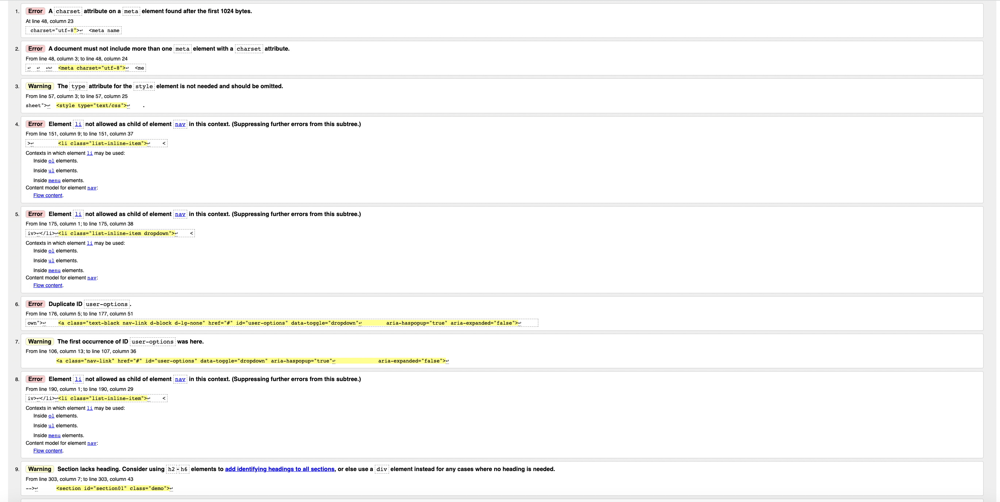

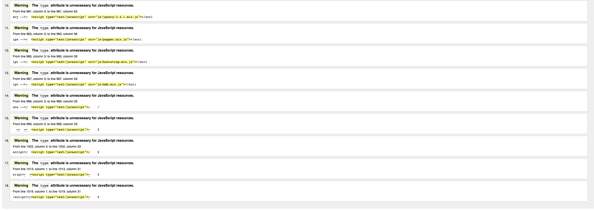

Most of these errors were easy fixes. The javascript errors were addressed by deleting the type="text/javascript" and tested again.

**Second Run Errors**

Second run errors - Click Here:

After running the validator for a second time the only errors displaying are from code taken from the Boutique Ado walkthrough project.

### W3C CSS Validator - CSS Testing

[W3C CSS Validator](https://jigsaw.w3.org/css-validator/validator)

Base.css - Click Here:

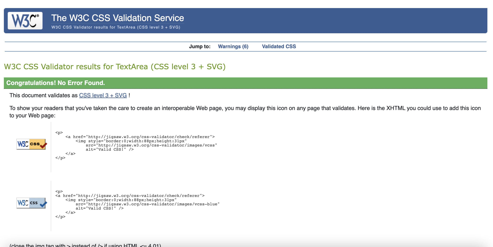

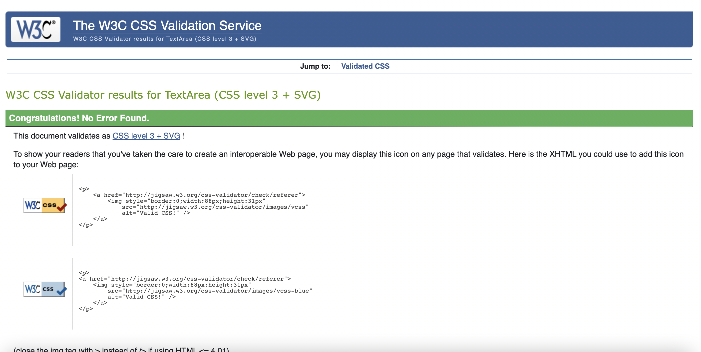   

CSS run through the W3C Validator and passing.

### JSHint - JavaScript Testing

[JSHint](https://jshint.com/)

 stripe_elements.js - Click Here:

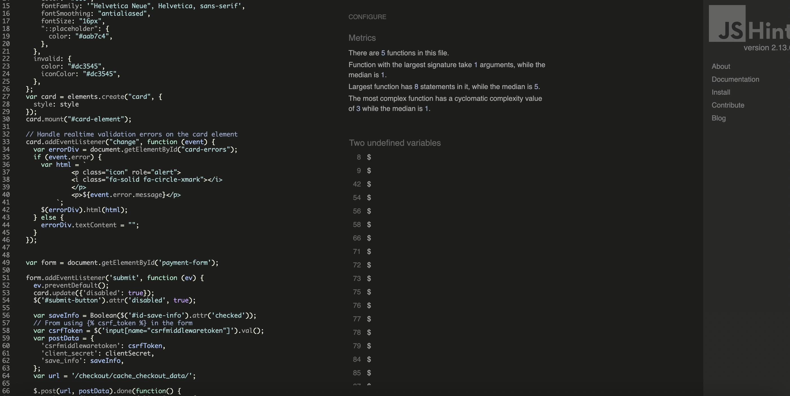

 countryfield.js - Click Here:

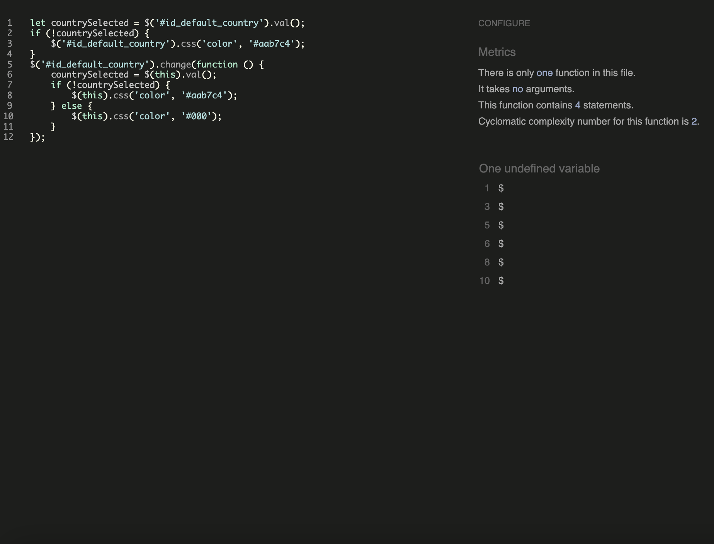   

### PEP8 Python Testing

Python code was tested to ensure that it met PEP8 style guidelines. This was done within the terminal console, which displayed errors and warnings throughout the project which were in parallel to the project being produced.

### Lighthouse

 Lighthouse Results - Click Here:

Homepage
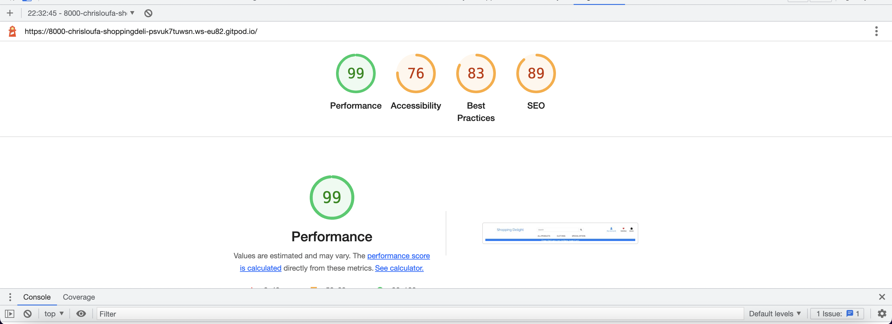

Products
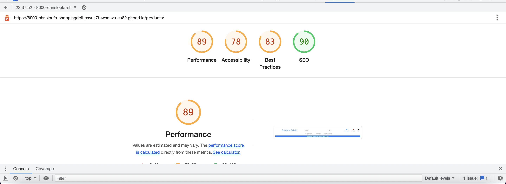 

Product Detail
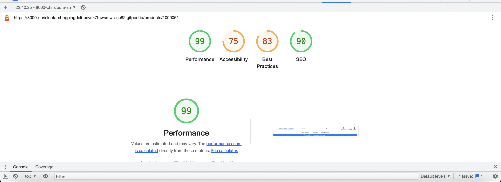 

Wishlist
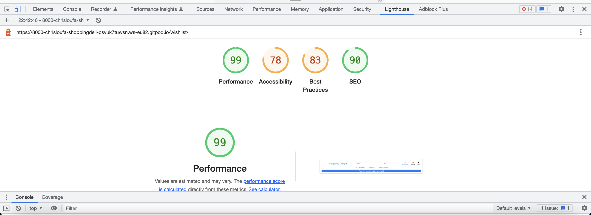 

## Manual Testing

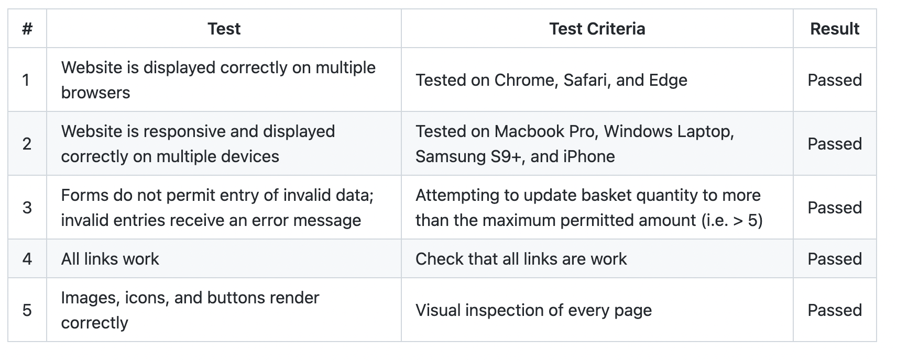 

## **Manual Testing by User Story**
### **Superuser / Admin**
### 1. As a Site Owner, I want to be able to add a product so that I can add more items to my store.
- Products can be added both via the project management page found by clicking on 'My Account' or vis the Admin Panel. Both types of product adding were tested and the products were both visable in the model and on the Products Page.

The following was also checked and found to be working as expected when the product was added:

- The required fields are validating correctly and error messages are explicit and related to each required field.
- All required fields are indicated with an asterisk.
- Number fields can only contain numbers.
- Images can be left out and a placeholder image takes its place.
- Images, when uploaded, are stored in the appropriate Cloudinary Folder.
- Buttons are highlighted on hover and take the user to the correct page:
    - Cancel takes the user back to the Products Page
    - Add product add the product and returns the user to the Products Page
- An alert message appears in the top right of the page to notify the user that the product has successfully been added.

### 2.	As a Site Owner, I want to be able to Edit/Update a product so that I can change the price, description, and other product criteria.

The below was tested by editing an existing product:

- Edit buttons are located on the product cards on the products page which are only accessible if you are a Superuser. 

I also attempted to edit products whilst signed in as a generic user. The edit button on the Product Cards weren't available and I was unable to sign into the Admin Panel.

- Clicking the Edit button takes the user to the product form which is already populated with the current information. I double checked this information matched the product I intended to edit, which it did. 
- The fields are validated the same way as if a new product was being added, all number fields must be numbers and required fields filled in. Error messages appeared as I attempted to input incorrect information and the form would not submit.
- Removing the image was tested and the placeholder image will replaced it upon saving as expected.
- If the image is replaced with a new image it is stored in the correct Amazon Web Services Bucket and Folder.
- The name of the image uploaded can be the same as an image that exists.
- An alert message appears in the top right of the page to notify the user which product they are currently editing. This matched the product name that was populated within the edit form.
- Buttons are highlighted on hover and take the user to the correct page:
    - Cancel takes the user back to the Products Page.
    - Update product saves the updated product information and returns the user to the Products Page. This is confirmed via the admin panel and the details on the Product Details page.

### 3.	As a Site Owner, I want to be able to delete a product so that I can remove items that are no longer available.

The following was tested by deleting a Product via the delete button on the Product Card:
- Clicking delete took the user to a Delete Confirmation Page. 
- Confirming delete removes the product from the product model and is no longer available to buy via the Products Page.
- The user cannot view the product with the URL. Using the link for a product that no longer exists takes the user to a 404 error page.
- A success message at the top right of the page confirms the product is successfully deleted.

### 4.	As a Site Owner, I want to be able to send emails to customers with a subscription, notifying customers of any deals, sale and new arrivals.

- Customers who sign up for emails are added to the business's Mailchimp contacts list where they can be unsubscribed. Users can contact the owner via the 'contact us' form in the footer to unsubscribe. 

This was tested by subscribing with an email and checking the email list on Mailchimp to ensure it was submitted. I also check the unsubscribe functionality to ensure it was easy to remove an email from the email list.

- Unsubscribed users can re-subscribe by submitting their email again. This was tested by unsubscribing an email and then re-subscribing. The re-subscribed email is back in the email list as subscribed.

- An error message is displayed underneath the email box if there is an issue with the email provided. I attempted to subscribe with test@test.com, a message appeared underneath stating that I could not subscribe with this email.
- A success message is displayed underneath the email box to confirm the subscription. I tested this by submitting a valid email that exists. A success message appeared underneath, thanking the user for subscribing.

### 5.	As a Site Owner, I want to be able to remove reviews from the site without deleting them so that they can still be available if required.

- Status Field in Admin Panel

Within the Admin panel, the Superuser is able to remove a review from the site without deleting it by un-ticking the status checkbox within the review. This was tested by un-checking the status box on one of the submitted reviews. I then went to the product the review was for to check whether the review was still posted on the Product Details page. The review was removed without being deleted and the total count of review decreased.

### 6. As a Business Owner I want to Create discount codes for customers so that I can reward loyal customers.

This was tested by creating the coupon code ‘FIRST_TIME’ in the Coupon database with a discount of £20. This was then applied to a shopping bag on the checkout page. The discount was applied as expected and the new Grand Total charged to the customer was reflected in the order confirmation, on the Stripe payment and in the order confirmation emails. Deleting the coupon from the database doesn’t change the price of previous orders and is no longer available when input at checkout. It sends an error message to the user that the coupon has not been accepted. 

### **Shopper**
### 1. As a Shopper, I want to be able to view a list of items so that I can add them to my basket.

- All products are displayed using Bootstrap Cards and Responsiveness classes to ensure the card layout changes dependant on screen size. I tested this by comparing the model with the products displayed on the site. The number of products matched along with the details of the products listed. 

- Products can be viewed together or by category and can be further filtered using the sort box on the top right of the products pages. This was tested by clicking through each category and sort to check the products listed match the filter that was in place. Categories matched categories without missing items, and the sort filtered the products in the order specified by the user.

- All product images are displayed and where they do not exist there is a placeholder. This was tested by adding a product without an image to see what happens when submitted. The placeholder image was in place as expected and when edited the image was replaced with a product image.

- All products have a required title, price and category attached to the product card. This was tested by trying to submit a new product without this information included individually. When either of these fields are missing, the form validation prevents the form from submitting until the fields are completed.

- Edit and Delete buttons are unavailable to non-superusers. This was tested by signing in as a generic user. When navigating to the products the edit and delete buttons are unavailable and the user was unable to access the Admin Panel to edit/delete the product from there.

###	2. As a shopper, I want to be able to click into an item so that I can view a product description and add to the basket.

I tested this by: 
- Clicking a Product Card. I was taken to the correct item as the product image, title, and price matched the Product Card clicked on. The user can also see the description of the item they are viewing which matched the description in the model for that product. 

### 3. As a shopper, I want to be able to add items to my basket so that I can keep track of what I am spending.

The following scenarios were tested by checking the items added to the Shopping Bag:

- I added an item to the bag and checked the correct product was added.

- I increased the quantity before adding to the shopping bag and checked whether the quantity in the bag matched what was was added.

- I tried to add 0 or a quantity over 99, an error message by the quantity field notifies the user that the quantity can only be between 1-99. If the user uses the buttons rather than typing the quantity, the buttons are disabled if attempting to decrement to 0 or increment above 99. I was unable to add a quantity that wasn't within the specified quantity allowance.

- Once an item has been added to the shopping bag a success message appears in the top right corning, notifying the user of the specific product and quantity added, how much more to spend to save on delivery and a link to the shopping bag. The product in the toast matched the Product Details I was in and the item that was in the shopping bag.

All items were added as they should be to the shopping bag and tested through to order completion to ensure the items added to the shopping bag matched the completed order.

### 4. As a shopper, I want to be able to be able to adjust the quantity of products in my basket so that I can make changes to my purchases before checkout.

The following scenarios were tested by completing the order and checking what was submitted in the Admin:

- Increasing the quantity of an item in the shopping bag.

- Decreasing the quantity of an item in the shopping bag.

- Removing an item out of the shopping bag.

All of the above actions are reflected correctly in the Order database along with the correct total delivery and grand total prices. 

### 5. As a shopper, I want to be able to be able to enter payment information so that I can check out quickly and hassle free.

The checkout function was tested using Stripe's test card number. 

The following scenarios were tested to ensure the checkout went through securely:

- Submitting an order, completing only the required fields on the checkout form. The order went through both on Stripe and was stored in the Database with a success Webhook message.

- Attempting to submit an order with incorrect card details. An error message appears underneath the card details form confirming the details are incorrect.

- Attempting to submit an order with an expired card. An error message appears underneath the card details form confirming the card has expired.

- Submitting an order, completing only the required fields on the checkout form, with the form.submit() within the stripe_elements.js file commented out to simulate a user closing the page before the checkout success confirmation page has loaded. The order went through both on Stripe and stored in the Database with a success Webhook message.

- Attempting to submit an order with an incomplete order form. All empty required fields alert the user they must be filled to be completed and the form isn't submitted. 

The Order total was also compared on the checkout page, the successful checkout page, on Stripe, and within the Order database to ensure all totals matched.

### 6. As a shopper, I want to be able to be able to feel that my personal and payment details are safe and secure so that I can confidently carry out my purchase.

- Address details can be saved if the user has an account and updated/removed if the user wishes. This was tested by adding and removing an address via the profile page. An address was also added and saved to the profile upon checkout to test that it saved within the User's Profile page.

- The project uses Stripe to process payments, keeping the user's payment information safe and not stored within their user profile. 

- Payment information isn't stored in any of the project's models or reflected in any confirmation emails.

### 7. As a shopper, I want to be able to be able to view an order confirmation so that I can verify my order is correct.

- Users with a profile have a list of orders made on their profile page. Clicking the order number takes the user to view the confirmation page that was displayed directly upon checkout. The confirmation contains the following details of the purchase:
    - Order Number
    - Order Date
    - Product Name and Quantity
    - Price per item
    - Delivering to
    - Phone Number
    - Address
    - Order Total
    - Delivery Cost
    - Grande Total

- The above details contained within the order confirmation matched the items initially added to the shopping bag, the checkout form page Order Summary, and the order in the database.

### 8. As a shopper, I want to be able to receive an email confirmation of my order so that I have proof of my order for my records.

- Email confirmation was tested by placing an order to an email address that can be checked. An email confirmation matching the template set up in the checkout app was received with the correct order details within and a contact email for if there was an issue with the order.

### 9. As a shopper, I want to be able to be able to order without creating an account so that I can make one-off orders.

An order was placed without being logged into an account. It was tested by comparing the the order confirmation, email confirmation, and the order within the order model to ensure it matched what was placed in the bag and then checked out. Also, the order event on Strip matched the total cost of the order. 

### 10. As a shopper, I want to be able to be able to sort a specific category of a product so that I can find the best price quickly for the product I am looking for.

- The navigation contains the multiple categories on offer. It was tested by clicking through and ensuring the category tag on each product card matched the category the page was displaying. 

- within the following Nav headings, their particular categories are listed when clicked, allowing for further filtering per section:
    - All Products
        - By Price
        - By Category
        - All Products
    - Clothing
        - Shoes
        - T-shirts
        - Jackets
        - Hats
        - Watches
        - All clothing
    - Special Offers
        - Clearance 

### 11. As a shopper, I want to be able to be able to sort multiple categories and products simultaneously so that I can find the best priced product over a broader range of categories

Testing the sort functionality was done within the all products tab as it contained the majority of products. The sort options tested were:

- Price (Low to High)
- Price (High to Low)

These were tested by checking the first and last price of the items on the page to check they sorted correctly. 

- Name (A to Z)
- Name (Z to A)

These were tested by checking the first and last Name of the items on the page were in alphabetical order. 

- Category (A to Z)
- Category (Z to A)

These were tested by checking through the of list items on the page and checking the categories were in alphabetical order. 

All sort options work as expected.

### 12. As a shopper, I want to be able to be able to easily see what I’ve searched for and the number of results so that I can quickly see whether the product is available.

This was tested by:

- Searching via the search box
- Searching through the categories 

The quantity for the search is displayed at the top left of the page, along with the search term and the number displayed matched the number of searches on each page.

### 13. As a shopper, I want to be able to be able to easily register for an account so that I can have a personal account and view my profile and purchase history.

This was tested by registering a couple of user accounts and:

- logging out and back in to ensure they worked
- Confirming the account via email
- Checking the Admin panel for confirmed email addresses
- Attempting to create an account with an email address that already exists

The above ensured the user accounts were generated. 

To test profile information I added an address and attempted to checkout an item. This ensured that the address saved in the profile was auto-filled on the checkout page. To test this further I made an order, ensuring the save details to profile checkbox is ticked and checked the address saved to the user's profile. 

To test the order history, I checked whether the orders that were placed to test the profile information had been saved to the profile, and the information contained in the order matched what was placed in the bag and checked out. All orders made were listed with a link to the Order Confirmation page.

To test that accounts cannot be created with the same email address I attempted to create an account for an email that already exists. An error message occurred after I clicked submit, ensuring I was unable to create the duplicate account.

### 14. As a shopper, I want to be able to be able to recover my password so that I can recover my account access.

This was tested by clicking the 'Forgot Password' link at the bottom of the login page. The user then receives a link via email, therefore I tested this with an existing email to ensure the link was received.

There is a wait for the password reset link to be sent but when it comes through, the user is taken to a page where they reset the password by entering it twice. After the new password has been entered, the user is re-directed to a confirmation page with a bootstrap toast displaying a success message. If the passwords do not match then an error message notifies the user so they can try again.

Once reset, the user must then re-login with the new password, which was tested to confirm the password change and that the correct user is now logged in.

### 15. As a shopper, I want to be able to be able to receive a registration confirmation email so that I can confirm registration.

This was tested by registering for an account. To complete registration, the user must receive an email with a link that confirms their email address. This was tested with an outlook email address that was created for testing. The email was received and the account was confirmed via the link.

### 16. As a shopper, I want to be able to be able to sign up for emails so that I can be notified of new releases, deals, and upcoming sales.

Contained in the footer, the user can subscribe by entering their email and clicking submit. If there is an error with the email, an error message appears underneath the email box. If successful then there is a success message instead. 

The subscription was tested by using a test email to subscribe and logging into Mailchimp and checking the contacts. Once confirmed the contact was there I scrolled across to see if they were subscribed. From here I also tested unsubscribing a user to ensure it is possible if a request came in. 

### 17. As a shopper, I want to be able to be able to contact the site owner so that I can ask about my order or for further information not contained within the Footer Pages.

The contact form link is placed within the footer and takes the user to the contact page. The form was tested by ensuring:

- the required fields must be completed before submission.
- The form fields took the correct information:
    - the email input took only emails
- The message box could hold enough text for a message.
- the form submitted the message to a working email for the site owner to respond.

### 18. As a shopper, I want to be able to be able to review products purchased on the site so I can share my thoughts with other shoppers and the business.

The review section was tested by:

- Attempting to submit a review without being logged in

This worked correctly as you must have an account to submit a review. Without an account the form isn't visable on the Product Details page, only a message asking the user to login if they want to review.

- Logging into an account and submitting a review

This worked as the review was linked to the product in the backend and was also displayed on the Product Details page.

- Clicking submit without adding a review

Both the rating and the review sections are required fields so the form cannot be submitted without them both being filled in. The rating is checked at 5 stars so if the user doesn't pick a star rating it will automatically submit with 5 stars. The user is able to edit their review if they wish to change this.

- Deleting the Product removed the reviews from the model

This was tested by adding a new product to the shop. I then added a review, followed by deleting the product. The review was deleted from the database along with the product. I checked this by signing into the admin panel and checking the list of reviews. The review added to the product what was deleted from the Review model as was the product from the Products model.

### 19. As a shopper, I want to be able to be able to edit and remove my reviews of products purchased so I can share or remove my reviews if my opinions change.

- Edit and Delete Review Buttons

All reviews can be edited by the superuser, otherwise the user can only edit their own reviews. This was tested as the edit button is only visable if you are signed in as a superuser or the signed in user id matches the review's user id. To test this I added a review whilst signed in as admin. I then signed in under a separate generic user. When viewing the review I added, I could not see the edit or delete buttons but when I signed in as admin again they were visable. I also added a review as a generic user and then signed in as the Superuser. I was able to then edit and delete the review added by the generic user. 

- Edit the Review 

Editing the review takes the user to a new page to edit the review. The form is filled in with the current review information. This was tested by changing the rating and the review comment and checking the review was altered on the product details page. After submitting you could see the review had changed both on the details page and in the Review model. 

- Editing the review as a Superuser

Editing a review left by a general user doesn't change who the review was left by on the details page. This was tested by adding a review as a generic user and re-signing in as the Superuser to edit it. Upon editing the review, the amendment is made but the user it was originally left by stays the same. 

- Deleting the review

Clicking on delete takes the user to the delete confirmation page to prevent the user from accidentally deleting their review. On this page they have the option to confirm deletion of the review or go back to the product details. When the Delete button is clicked the review it removed from the model and is no longer displayed on the product details page. The review count also decreases. When clicking cancel, the user is taken back to the product details of the product they were previously in. You can also see that the count remains the same and the review is still visable on the details page and in the model. 

### 20. As a Shopper I want to save Items to my wishlist so that I can purchase them later without having to search for them.

- Add products to Wishlist

This was tested by adding a few items into my wishlist and checking they were accessible from my wishlist page. All of the items added were available from ‘My Favourites’ and were easily removable to clicking the ‘Remove from wishlist’ button.

- Must have an account to add to wishlist

This was also tested to ensure the user could not add an item to their wishlist without being logged in by logging out and trying to add and access my wishlist again. Without being logged in, the icon to add to wishlist was not available on the product card and I could not access the wishlist page with the url.

- Removing products from your wishlist list

This was tested by adding items to my wishlist and testing the remove buttons on the product details page and on the product card within the'My Favourites' page. All items were removed from wishlist and confirmed within admin.

- Removing products from wishlist if no longer available

This was tested by deleting a product from the site to ensure it was removed from the user’s favourited items. When the product was deleted, the item was removed without any issues and no longer available from the ‘My Favourites’ page.

# Deployment

## GitHub Pages
1. Log into GitHub and locate the repository.
2. On the nav bar look for the settings option and click on it.
3. Scroll towards to the bottom of the page.
4. Click the yellow "check it out here" link under GitHub pages.
4. Under 'Source' dropdown, click 'Main' from the options.
5. Click the save button.
6. The sitre will then be published. 
7. The site URL is visible on the green bar under the "Github Pages".

## Gitpod

1. You will need to search for and download the Gitpod browser extension.
2. Then proceed to login to GitHub.
3. Find the repository you wish to view.
3. Click the green "Gitpod" button.
4. Now you will be taken to a new tab and will be able to view the Gitpod repository.

## Heroku

1. Create the Heroku App:
    - Before creating the Heroku app make sure your project has the following files:
        - requirements.txt to create this type the following within the terminal: **pip3 freeze --local > requirements.txt**.
        - Procfile to create this type the following within the terminal: **python run.py > Procfile**.
    - Select "Create new app" within Heroku.
2. Attach the Postgres database:
    - Search "Postgres" within the Resources tab and select the Heroku Postgres option.
3. Create the settings.py file:
    - In Heroku navigate to the Settings tab, click on Reveal Config Vars and copy the DATABASE_URL.
    - Within the GitPod workspace, create an env.py file within the main directory.
    - Import the env.py file within the settings.py file.
    - Create a SECRET_KEY value within the Reveal Config Vars in Heroku.
    - Add the DATABASE_URL value and your chosen SECRET_KEY value to the env.py file.
    - Run the following command in your terminal **python3 manage.py migrate**.
    - Add the CLOUDINARY_URL to the Reveal Config Vars in Heroku and add this to your settings.py file.
    - Add the following sections to your settings.py file:
        - Cloudinary to the INSTALLED_APPS list
        - STATICFILES_STORAGE
        - STATICFILES_DIRS
        - STATIC_ROOT
        - MEDIA_URL
        - DEFAULT_FILE_STORAGE
        - TEMPLATES_DIR
        - Update DIRS in TEMPLATES with TEMPLATES_DIR
        - Update ALLOWED_HOSTS with ['app_name.heroku.com','localhost']
4. Store Static and Media files in Cloudinary and Deploy to Heroku:
    - Create three directories in the top level directory: media, storage and templates.
    - Create a file named "Procfile" in the main directory and ass the following: [web: gunicorn project-name.wsgi].
    - Login to Heroku within the terminal window using **heroku login -i**
    - Run the following command in the terminal window: **heroku git:remote -a your_app_name_here**. By doing this you will link the app to your GidPod terminal.
    - After linking the app you can deploy new versions to Heroku by running the command **git push heroku main**.
5. Follow the steps directly from the Stripe website.

    - Create a Stripe account here.
    - Go to Developers > API Keys.
    - Find and copy the 'Publishable key', which will be for the STRIPE_PUBLIC_KEY in your env.py file in Gitpod.
    - Find and copy the 'Secret key', which will be for the STRIPE_SECRET_KEY in your env.py file in Gitpod.
    - Go to Webhooks > Add Endpoint button.
    - Add the url for the website (followed by /checkout/wh/).
    - Click Select Events > tick Select All Events > click Add Events button.
    - Reveal the Signing secret key, copy it, and add it to the env.py file in Gitpod as STRIPE_WH_SECRET.
    - A webhook will now be set up and ready to be tested on your local database.

# Media

[Google](https://images.google.com/)
Images sourced from Google

# Future Updates

- Email when orders are set to completed (i.e. items shipped).
- More admin/superuser rights from the website itself.
Quick-Buy options directly from the product pages.

# Credits

- Homepage Carousel](https://azmind.com/bootstrap-carousel-multiple-items/)

- Stack Overflow

- Boutique Ado walkthrough project

